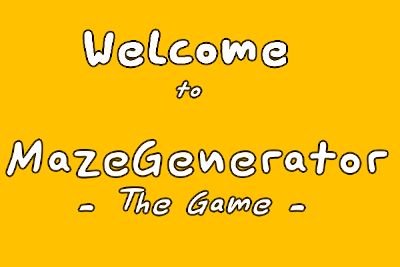
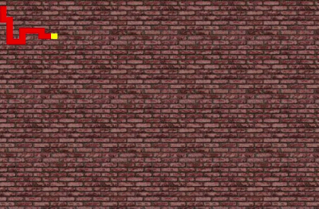

# sMaze
In this game two players struggle to collect the most sheep in a randomly generated maze.
One player can send out dogs that run around, collecting sheep.
The other can teleport, even through walls.

## Instructions
Move the actors through the maze with either \[wasd\] or the arrow keys.
Collect all the sheep.
Use your special power wisely with either \[spacebar\] or \[enter\] to gain an advantage!

## Authors
Jonas Thelemann, Nur Çobankara
